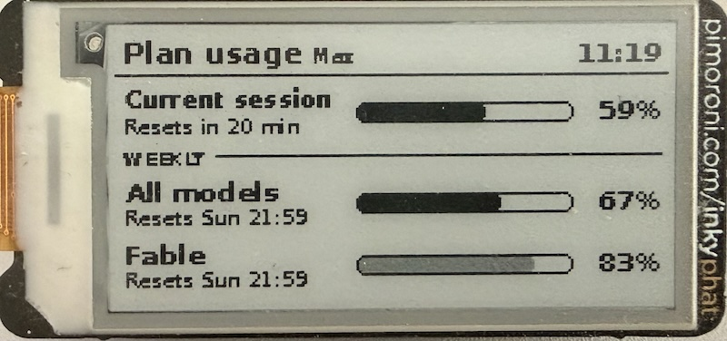

# claudeink

Claude usage limits on an Inky pHAT, in the spirit of [octowait](https://github.com/simonhearne/octowait).

Lays out the same three windows as Claude Code's own `/usage` report — **Current session**,
and under a *Weekly* divider, **All models** and **Fable** — each with a pill progress bar,
its reset time, and a percentage. Clock top right.

```
 Plan usage  Max 5x                        15:33
 ─────────────────────────────────────────────────
 Current session       ▰▰▰▰▰▰▰▱▱▱▱▱▱        55%
 Resets in 2 hr 19 min
 WEEKLY ──────────────────────────────────────────
 All models            ▰▰▰▰▱▱▱▱▱▱▱▱▱        33%
 Resets Sat 21:59
 Fable                 ▰▰▰▰▰▰▱▱▱▱▱▱▱        45%
 Resets Sat 22:00
```



## Refresh

Refreshes every 5 minutes (`REFRESH_MINUTES=5`), sleeping to the boundary rather than
sleeping a fixed 300s, so the clock doesn't drift or skip a minute. That's ~288 panel
updates a day — fine for a pHAT, but also defaults to `QUIET_START=20 QUIET_END=7` to stop refreshes overnight (pi local timezone).

Session reset is shown as a live countdown, weekly resets as day + time, matching the
native report.

## Install

**Assumes a Pi Zero W v1.1. You might need to tweak things if using a different model.**

### 1. Flash a new image

Flash a new image to your SD Card using the [Raspberry P Imager](https://github.com/raspberrypi/rpi-imager) - I recommend `Raspberry Pi OS (Legacy, 32-bit) Lite`.

Bookworm (32-bit Lite) works too; the venv-based install below covers both. Check with
`python3 -V` — 3.9 is Bullseye/Legacy, 3.11 is Bookworm.

Hit gear/⚙ for the pre-configuration once OS is selected:

- Hostname: claudeink
- Enable SSH
- Username pi — the systemd unit hardcodes /home/pi/claudeink, so either use pi or remember to edit the unit later
- Locale: your local timezone
- Wifi + country

Continue and wait for the flash to complete.

### 2. Enable SPI and install the Inky library

```bash
sudo raspi-config nonint do_spi 0
sudo raspi-config nonint do_i2c 0
sudo apt update && sudo apt full-upgrade -y   # go make a coffee, this is slow on a Zero
sudo apt install -y python3-pip python3-venv fonts-dejavu-core
sudo reboot
```

You do *not* need `curl https://get.pimoroni.com/inky | bash` — `requirements.txt` pulls
the same library, and on Bookworm that installer drops it in its own
`~/.virtualenvs/pimoroni` which the service can't see.

### 3. Copy the project over

Clone this repo, then modify the `claudeink.service` [unit file](#config) to meet your requirements, then from your machine, in the directory containing claudeink/:

```bash
scp -r claudeink pi@claudeink.local:~/
```

Then on the Pi:

```bash
cd ~/claudeink
python3 -m venv --system-site-packages .venv
.venv/bin/pip install -r requirements.txt
```

**Use a venv, not `pip3 install`.** On Bookworm (Python 3.11) a bare `pip3 install`
fails with `error: externally-managed-environment` and installs nothing — the failure is
easy to miss, and the first sign is `no inky detected (No module named 'inky')` in the
journal, with the panel silently falling back to `frame.png`. The unit file's `ExecStart`
points at `.venv/bin/python` for this reason.

`--system-site-packages` lets the venv still see apt-installed `python3-rpi.gpio` /
`python3-spidev` if you have them.

### 4. Set Claude credentials

The script reads `~/.claude/.credentials.json` — the same file Claude Code maintains.
Copy it over from a machine where you're logged in:

```bash
scp ~/.claude/.credentials.json pi@claudeink.local:~/.claude/.credentials.json
ssh pi@claudeink.local chmod 600 ~/.claude/.credentials.json
```

**Token refresh:** Claude Code isn't running on the Pi, so nobody is refreshing the access
token for you — it'd expire in hours. `refresh_token()` handles this itself using the
`refreshToken` field. That endpoint and client id are reverse-engineered from the Claude
Code client, not documented API, so treat them as the most fragile part of this project.
If refresh starts failing you'll see it in the journal and the clock gets a `!` prefix to
show the data is stale; re-copy the credentials file to recover.

Nothing about `/api/oauth/usage` is a supported interface either. It can change without warning.

## Test

```bash
.venv/bin/python run.py --demo --once --png   # synthetic data, writes frame.png, no hardware needed
.venv/bin/python run.py --once                # one real frame to the panel
```

If no Inky is detected it falls back to writing `frame.png`, which is handy over ssh.

## Run as a service

```bash
sudo cp claudeink.service /etc/systemd/system/
sudo systemctl enable --now claudeink
journalctl -fu claudeink
```

## Web UI (optional)

Set `WEB_UI=1` to serve a full-page, e-paper-styled status site (default port 8080,
`WEB_PORT` to change). Stdlib only — nothing new to install. It shows stat tiles
with reset countdowns and change-per-hour, pill bars for **every** limit window the
API reports (the panel only fits three), a usage-history chart with 6h/24h/7d/30d
ranges and a crosshair tooltip, dark mode, and a live preview of the physical
frame. The *Refresh now* button wakes the render loop immediately — bypassing quiet
hours and API backoff, since it's an explicit request. With the ui enabled, every
successful poll is appended to `history.jsonl` (`HISTORY_FILE`, `HISTORY_DAYS`
retention) and served to the chart with bucket-max downsampling.

| Endpoint | Purpose |
| --- | --- |
| `/` | full status page |
| `/frame.png` | latest rendered frame |
| `/status` | JSON: all limit windows, updated timestamp, stale flag |
| `/history?hours=N` | JSON usage history (optional `&points=M`) |
| `/payload` | last raw API payload |
| `POST /refresh` | force an immediate fetch + render |

## Config

All via environment (set them in the unit file):

| Var | Default | Notes |
| --- | --- | --- |
| `REFRESH_MINUTES` | `1` | minutes between panel refreshes |
| `PLAN_LABEL` | *(empty)* | e.g. `Max 5x`, drawn beside the title |
| `WARN_AT` | `80` | % at which a bar fills red instead of black |
| `QUIET_START` / `QUIET_END` | *(unset)* | hours to pause refreshing, e.g. `23` / `7` |
| `FLIP` | `0` | set `1` to rotate 180° |
| `FONT_REGULAR` / `FONT_BOLD` | DejaVu | TTF fonts available on the system |
| `CREDENTIALS` | `~/.claude/.credentials.json` | |
| `WEB_UI` | `0` | set `1` to serve the status web ui |
| `WEB_PORT` | `8080` | web ui port, used with `WEB_UI=1` |
| `HISTORY_FILE` | `history.jsonl` beside `run.py` | where usage history is recorded for the web ui chart |
| `HISTORY_DAYS` | `30` | history retention |

Times are rendered in the Pi's local timezone — `sudo timedatectl set-timezone Europe/London`
if you haven't already.

## Window keys

`ROWS` at the top of `run.py` maps each bar to a list of candidate API keys, tried in
order, with a fuzzy fallback. The Fable row tries `seven_day_fable` then `seven_day_opus`
— I couldn't verify which key that window actually uses. Run `--once` and if Fable shows
`--`, dump the raw payload and add the real key to that list.

## Layout

Sizes derive from `inky.resolution`, so it lays out correctly on both the 250×122 and
212×104 pHATs. Labels auto-shrink to fit their column rather than overflowing into the bar.

## Power saving

Run these on the pi to reduce compute / power consumption:

```bash
sudo /opt/vc/bin/tvservice -o
echo 'dtoverlay=disable-bt' | sudo tee -a /boot/config.txt
echo 'dtparam=act_led_trigger=none' | sudo tee -a /boot/config.txt
```
